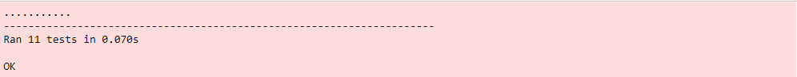
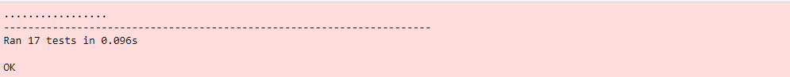
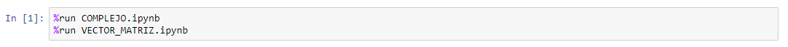
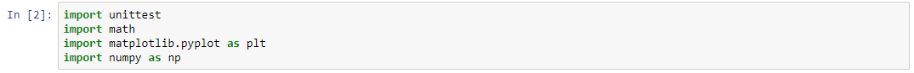
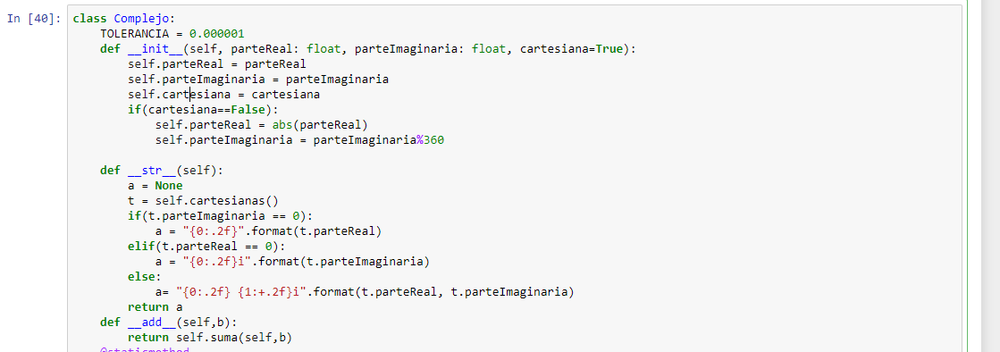
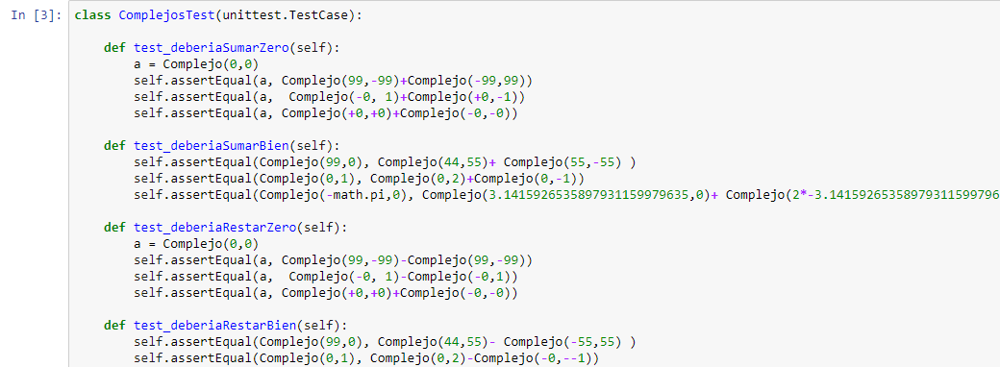

# **Ciencias Curso CNYT Ciencias naturales y tecnología**
> _**Proyecto #1: Calculadora de matrices complejas**_\
> _**4 de Septiembre de 2019**_\
> _**David Alejandro Vasquez Carreño**_

- Se definieron las siguientes clases con los siguientes métodos
    a) Clase Complejo: print(a) imprime el complejo con precisión de 2 decimales
    
        TOLERANCIA: Representa la distancia minima al definir igualdades entre reales
        Se presentará la operación y la manera de hacerla en la librería.
        Sea a y b números complejos representados en python, con parte real y parte imaginaria, teniendo las siguientes operaciones(a = Complejo(a,b) es igual a = a+bi):
	        1)  Suma         (a+b)
		2)  Producto            (a*b)
		3)  Resta              (a-b)
		4)  División             (a/b, excepcion si b=0)
		5)  Módulo            (a.modulo())
		6)  Conjugado            (a.conjugado())
		7)  Conversión entre representaciones polar y cartesiano        (a.polares() y a.cartesianas())
		8)  Retornar la fase de un número complejo.        (a.polares() par ordenado con modulo y fase, de tipo complejo)
	
	b) Clase Matriz: (a = Matriz(filas, columnas, [[]*columnas]*filas) donde cada elemento es un tupla con dos numeros(pares ordernados) [[(2,2)],[(1,1)]] matriz 2x1)
	
		1) Suma de vectores complejos     (a+b)
		2) Inverso aditivo de vector complejo      (a.inversa())
		3) Multiplicación de escalar por vector complejo       (a*c donde c es un escalar, c*a resultará en error)
		4) Suma de matrices complejas      (a+b)
		5) Inverso aditivo de matriz compleja      (a.inversa())
		6) Multiplicación de escalar por matriz compleja     (a*d donde d es el escalar, d*a resultará en error)
		7) Transpuesta de matriz compleja     (a.transpuesta())
		8) Conjugada de matriz compleja     (a.conjugada())
		9) Adjunta (daga) de matriz compleja      (a.adjunta())
		10) Producto de matrices complejas      (a*b, tener en cuenta los tamaños, de lo contrario excepción de usuario)
		11) Acción de matriz compleja sobre vector complejo     (b.accion(a) donde b es un vector y a es una matriz compatible)
		12) Producto interno de vectores complejos     (a.productoInterno(b) donde a y b son vectores del mismo tamaño)
		13) Norma de vector complejo     (a.norma())
		14) Distancia entre dos vectores complejos       (a.distancia(b) donde a y b son vectores y del mismo tamaño)
		15) ¿Es la matriz compleja una matriz unitaria?      (a.esUnitaria() -> bool)
		16) ¿Es la matriz compleja una matriz hermitiana?      (esHermitiana() -> bool)
		17) Producto tensorial de matrices complejas       (a.productoTensor(b))
    

> # Pruebas Complejo
	a) test_deberiaSumarZero():  Verifica que la suma de complejos de (0,0)
    b) test_deberiaSumarBien():  Verifica que la suma de complejos sea correcta
    c) test_deberiaRestarZero():  Verifica que la resta de complejos de (0,0)
	d) test_deberiaRestarBien(): Verifica que la resta de complejos sea correcta
    e) test_deberiaMultiplicarBien(): Verifica que la multiplicación de complejos sea correcta
    f) test_deberiaDarexcepcionZero(): Verifica que al dividir entre 0 se genere un error
	g) test_deberiaDividirBien():  Verifica que la division de complejos sea correcta
    h) test_deberiaModulo():  Verifica ciertos vectores con sus respectivos modulos, verificando que si coincidan los resultados
    i) test_deberiaConjugado():  Verifica el conjugado de ciertos vectores especiales
    j) test_deberiaPolar():  Verifica que la forma polar de un Complejo sea correcta
    k) test_deberiaCartesiano():  Verifica que la forma cartesiana de un Complejo sea correcta
    
   

> # Pruebas Matriz
    a) test_deberiaSumarVectores():  Verifica que la suma de vectores sea correcta
    b) test_deberiaInversoVector(): Verifica que el inverso aditivo de vectores sea correcto
    c) test_deberiaMultiplicarEscalarVector():   Verifica que la multiplicación por un escalat sea correcta
    d) test_deberiaSumarMatrices(): Verifica que la suma de matrices sea correcta
    e) test_deberiaInversoMatriz():  Verifica que el inverso aditivo de una matriz sea correcto
    f) test_deberiaMultiplicarEscalarMatriz():  Verifica que la multiplicación de una matriz por un escalar sea correcta
    g) test_deberiaTransponerMatriz():  Verifica que la transpuesta de una matriz sea correcta
    h) test_deberiaConjugar():   Verifica que la matriz conjugada de una matriz sea correcta
    i) test_deberiaAdjuntaMatriz():  Verifica que la adjunta de una matriz sea correcta
    j) test_deberiaProductoMatriz(): Verifica que la multiplicación entre matrices sea correcta
    k) test_deberiaAccion():  Verifica que la acción de una matriz sobre un vector sea correcta
    l) test_deberiaProductoInterno():  Verifica que el producto interno entre 2 vectores sea correcto
    m) test_deberiaNormaVector():  Verifica que la norma de un vector sea correcta
    n) test_deberiaDistancia(): Verifica que la distancia entre 2 vectores sea correcta
    ñ) test_deberiaSerUnitaria():  Verifica que verifique correctamente matrices unitarias
    o) test_deberiaSerHermitiana():  Verifica que verifique correctamente matrices hermitianas 
    p) test_deberiaProductoTensor():  Verifica que el producto tensor entre 2 matrices funciones correctamente
 
       

> # Información dirigida al usuario
> Para utilizar las clases o pruebas tenga en cuenta la siguientes pasos:
>>  1)  Correr las otras librerías que sean requeridas, como complejo o matriz
>>  
>>  2) Importar las librerías de python, como math, numpy, etc.
>>  
>>  3) Ejecutar la clase que desee utilizar. En el caso de pruebas ejecuta el bloque y obtiene el resultado
>>  
>>   
>>  4) Listo para usar(instanciación y ejecución de servicios de las clases)

- # Clase Systems (SISTEMAS_CLA_PROB_CUAN.ipynb)
		Representa un sistema de dinámica con propiedades probabilisticas, clásicas o cuánticas   
    	    a) Atributos: Repsesentan los posibles estados que pueden tomar los sistemas dinámicos:     
    	    	1) CLASSIC: Dinámica clásica   
    			2) PROBABILISTIC: Dinámica probabilistica   
    			3) QUANTUM: Dinámica cuántica   
    			4) SLIT_QU: Dinámica de rendija cuántica   
    			5) SLIT_PROB: Dinámica de rendija probabilistica   
			    6) INVALID_SYSTEM = El sistema que se dio no es válido   
	    		7) INCORRECT_FORMAT = La matriz de dinámica no cumple su propiedad especificada   
	    		8) INVALID_VECTOR = El vector inicial o de probabilidades no es válido   
    	Métodos:   
		    	1) __init__(systemType, matrix, state0, clicks, statesA, statesB, assembled): 
			    	Constructor que recibe la propiedad de la dinámica, la matriz de dinámica, el estado inicial y los clicks. Opcionalmente recibe la dimensión de los estados iniciales en los ensambles, y recibe el parámetro de si es un ensamble o no.
		    	2) verifySystem(matrix, systemType): 
			    	Verifica si la matriz dada cumple las propiedades del sistema especificado
				3) verifyClassic(matrix): 
					Verifica que la matriz dada cumple dinámica clásica
				4) verificarColumnasEstocasticas(matrix): Verifica que las columnas de la matriz son columnas estocásticas
			    5) verificarFilasEstocasticas(matrix): 
				    Verifica que las filas de la matriz son filas estocásticas
			    6) verifyProbabilistic(matrix): 
				    Verifica que la matriz dada es doblemente estocástica
				7) verifyQuantum(matrix): 
					Verifica que la matriz cumple con las condiciones de dinámica cuántica
				8) verifyVector(state0, systemType): 
					Verifica que el vector dado cumple con la propiedad de dinámica dada
				9) success(): 
					Retorna si el sistema fue creado con éxito
				10) obtainType(matrix): 
					Retorna el tipo de dinámica que cumple la matriz dada
				11) assembleSystems(systemA, viA, systemB, viB, t): 
					Ensambla dos sistemas(systemA, systemB) con vectore iniciales(viA, viB) con t clicks de tiempo.
				12) fullSlits(matrix, slits, typeS): 
					Llena la matriz de rendijas dependiendo del tipo de rendija(cuántica o probabilistica)
				13) fullTargets(matrix, slits,targets, vector): 
					Llena la matriz de rendijas con los pesos de los blancos, teniendo en cuenta el vector de probabilidades
				14) fullReturn(matrix, slits,targets): 
					Llena la matriz de rendijas con los retornos de los blancos a si mismos
				15) doubleSlit(slits, targets, vector): 
					Crea un sistema de rendijas, recibiendo el número de rendijas, el número de blancos y el vector de probabilidades. El vector de probabilidades determina el tipo de sistema(cuántico o probabilistico)
				16) obtenerDatos(): 
					Retorna el vector probabilistico despúés de tantos clicks
				17) showGraphic(): 
					Muestra el gráficode barras del vector de probabilidades después de t clicks
###	Pruebas:
	- def test_deberiaClasico(self): Revisa que sea posible ensamblar un sistema clásico de manera exitosa, cumpliendo las coindiciones de un sistema clásico
    - def test_deberiaEnsamblar(self): Revisa que sea posible ensamblar un sistema probabilistico
	- def test_deberiaClfffasico(self): Revisa el resultado después de t clicks
	- def test_deberiaCrearRendija(self): Revisa que se pueda crear un sistema de rendijas de manera exitosa
	- def test_deberiaMediaObservavbleFallar(self): Revisa que las funciones revisen que los obervables no hermitianos
	- def test_deberiaMedia(self): Revisa que la media de ciertos casos sea la esperada
	- def test_deberiaPerticula(self): Revisa los resultados de probabilidad de un ket
	- def test_deberiaVarianza(self): Revisa que la varianza de ciertos casos sea la esperada
        
        

		

